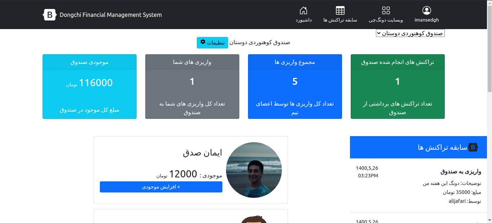

# Dongchi App
 [](https://opensource.org/licenses/GPL-3.0) 

Dongchi is a simple service made for personal usage and now is published for free use 

 ## Table of Contents  
- [Introduction](#dongchi-app)  
- [About the project](#about-the-project)  
- [Getting Started](#getting-started)  
- [installation](#docker-installation-recommended)  
- [Screenshots](#screens)  
- [Contribution](#contribution)


## About The Project
Dongchi is a Service in which you could manage your "Dong"s.
You can create a safe box (صندوق) and invite your friends to join .
Each member of the safe box owns a balance and each box has got a sum total balance of all members` parts.
Regarding the bright side, each user could take part in several different boxes or even create one as easy as possible .
When you deposit some money in one of your boxes, your own balance and total balance will increase(only in that specific box)
and when some money takes out, the balance of members would equally decrease.

### Built With
I used Django framework for backend and Bootstrap for forntend

* [Python](https://python.org)
* [Django](https://djangoproject.com)
* [Bootstrap (front-end)](https://getbootstrap.com)

## Getting started
you can simply run Dongchi in a server or your localhost by running docker containers without running in issues
or you can clone this repo and run dongchi  in localhost like other Django projects by editing mysql database creditions (in .env file)  and  `python manage.py runserver`

### Docker installation (Recommended)
in this way you can easily run Dongchi in your localhost or server whithout dealing with database or web server configurations
####  Prerequisites
if you do not have installed docker and docker-compose install them in debian based distros by 
```
sudo apt install docker.io docker-compose
```
add your user to docker group then your user can run docker commands 
```
sudo usermod -aG docekr ${USER}
```
you can run ``docker ps ``  to make sure docker installed successfully 
find complete docker installation proccess in [docker documents](https://docs.docker.com/engine/install/)
#### Run docker containers
first clone git repository
```
git clone https://github.com/iman-sedgh/dongchi.git
cd dongchi/
```
create this docker volumes 
```
docker volume create dongchi_media_volume
docker volume create dongchi_static_volume
docker volume create mysql_data_volume
```
create this docker networks
```
docker network create mysql_network
docker network create nginx_network
```
run django and database containers (needs to be in 'dongchi' directory)
```
docker-compose up -d 
```
run nginx webserver container 
```
cd config/nginx 
docker-compose up -d 
```
Done ! 
now dongchi web service should be up on port 80 
you can see containers with `docker ps ` command
expected output should be something like this: 
```
CONTAINER ID   IMAGE             COMMAND                  CREATED        STATUS         PORTS                                                  NAMES
70bdfa7cc1ea   nginx_nginx       "nginx -g 'daemon of…"   14 hours ago   Up 3 minutes   0.0.0.0:80->80/tcp, :::80->80/tcp                      nginx
1add73db077f   dongchi_dongchi   "gunicorn --chdir /h…"   14 hours ago   Up 3 minutes   0.0.0.0:8000->8000/tcp, :::8000->8000/tcp              dongchi_dongchi_1
1e735ad769dd   mysql:5.7         "docker-entrypoint.s…"   14 hours ago   Up 3 minutes   0.0.0.0:3306->3306/tcp, :::3306->3306/tcp, 33060/tcp   dongchi_mysql_1

```
migrations can apply to database by connecting to docker container and run migrate command
```
docker exec -it dongchi_dongchi_1 bash
python manage.py migrate 
```
creating superuser :
`python manage.py createsuperuser`
created superuser can login to admin panel ("domain.com/admin") superuser can create or manage deposit/withdraw/safebox/user ... from django admin panel

## Screenshots


## Contribution
contributions are what make the open source community such an amazing place to be learn, inspire, and create. Any contributions you make are **greatly appreciated**.
this project may have many issues feel free to contribute and make it better :) 

Its recommended to :

1. Fork the Project
2. Create your Feature Branch (`git checkout -b feature/AmazingFeature`)
3. Commit your Changes (`git commit -m 'Add some AmazingFeature'`)
4. Push to the Branch (`git push origin feature/AmazingFeature`)
5. Open a Pull Request